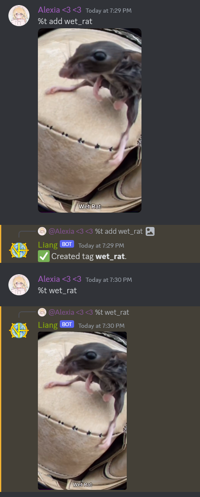
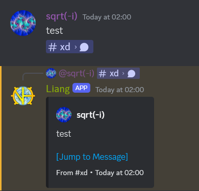
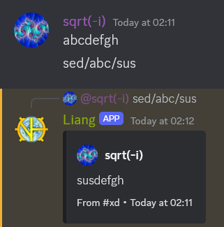
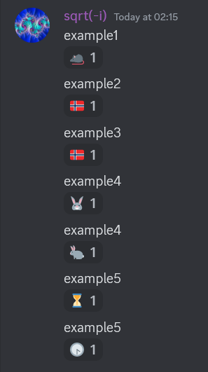
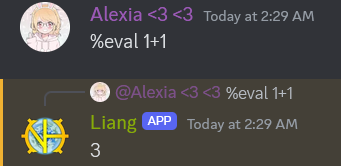

<div align="center"">
    <h1>EL LEVERT JR</h1>
    <br>
    
</div>

<h4 align="center">Romanian version of Leveret by Neeve</h4>

<div align="center">
    <a href="https://opensource.org/license/mit/">
        
    </a>
    <a href="https://discord.js.org/#/">
        
    </a>
    <a href="https://nodejs.org/en">
        
    </a>
    <a href="https://github.com/WeslayCodes/BoarBot/main">
        
    </a>
</div>

<div align="center">
  <a href="#commands">Commands</a>
  •
  <a href="#command-usage-example">Example</a>
  •
  <a href="#evaluation-api">API</a>
  •
  <a href="#config">Config</a>
  •
  <a href="#importing">Importing</a>
  •
  <a href="#amogus">Amogus</a>
</div>

# Features

- Tags
- JS eval
- Permission system
- Reminders
- Message previews
- ...and more!

# TODO

- [x] Fix oc (soon)
- [ ] Extract responses into a lang file
- [ ] Rewrite vm2 runner
- [ ] Finish CLI commands
- [ ] Add cabal
- [ ] Add the option to save tag attachments locally
- [ ] Add support for slash commands (perhaps)
- [x] Add the option to log to a channel
- [ ] Loading extensions
- [ ] Rewrite importer & add db check script
- [ ] Add support for other databases
- [ ] Add support for reading the token from environment variables

# Commands

### 1. help

Sends the list of base commands.

### 2. version

Displays the bot version.

### 3. t/tag `(name) args`

Execute tag `(name)`, receiving `tag.args` = `args`.

Subcommands:

- add `(name) [type] (body)` - Adds the tag `(name)`. If `body` contains a code block, it will be treated as a script tag. If an image file is attached, it will be added as a url. If a text file is attached, it will be added as a script. If the first argument is `vm2` the tag will be added as a vm2 script.
- alias `(name) (alias_name) args` - If tag `(name)` doesn't exist, it will be created and aliased to `(alias_name)` with `args` being appended to `tag.args`. If `(name)` already exists and is owned by you, it will be updated to be an alias. Moderators can bypass ownership checks.
- chown `(name) (new_owner)` - Transfers the tag to another user, specified either as a username, tag, mention or id.
- count `[all/me/user]` - Sends the number of tags that have been registered in total or by the specified user.
- delete `(name)` - Deletes tag `(name)` if it's owned by you or if you are a moderator.
- dump `[inline/full] [space]` - Sends a list of all tags.
- edit `(name) [type] (new_body)` - Edits tag `(name)` with a new body, same ownership and attachment rules as `add`.
- info `(name) [raw]` - Sends the properties of tag `(name)`. Moderator only.
- leaderboard `(count/size) [limit=20 < 100]` - Sends the tag leaderboard up to the specified limit.
- list `(user)` - Lists all of your tags. If `user` is specified, their tags will be listed instead.
- owner `(name)` - Sends the owner of tag `(name)`.
- quota - Sends your quota, affected by `add`, `alias`, `chown`, `delete` and `edit`. If your quota reaches the limit, you will not be able to add any more tags until you free up some space.
- raw `(name)` - Sends the text or source code of tag `(name)`.
- rename `(name) (new_name)` - Renames tag `(name)` to `(new_name)` if it's owned by you or if you are a moderator.
- search `(query) [max_results=20/all]` - Searches the tags list for `(query)`. Matches are approximated, suspicious results are to be expected.
- set_type `(name) (type)/[version]` - Sets the type or version properties of tag `(name)`. Moderator only.

### 4. eval `(script)`

Evaluates specified script. See the [API](#evaluation-api) section for more information.

Subcommands:

- langs - Sends the list of enabled languages.
- vm2 `(script)` - Eval script with the VM2 backend. See [API/vm2](#2-vm2--nodejs-api) for more information.
- c, cpp, py `(script)` - Eval script with the external VM backend, quite slow.

By default, only the default JS eval is enabled. The other eval contexts can be enabled in the config.
VM2 eval only works under Linux/WSL and the external VM backend needs [judge0](https://judge0.com/) to be installed and configured.

### 5. perm

Root command for the permission manager. Can be executed by anyone.
For this feature to work properly, set the `owner` field in `auth.json`.

Subcommands:

- add `(group_name)` `(user)` - Add `(user)` to `(group_name)`. Can be executed by admin and above. Cannot add yourself to a group with a level higher than your own.
- remove `(group_name)` `(user)` - Remove `(user)` from `(group_name)`. Can be executed by admin and above.
- remove_all `(user)` - Remove all of `(user)`'s permissions.
- list - Sends registered permissions. Can be executed by anyone.
- add_group `(group_name) (level)` - Adds `(group_name)` with the specified level.
  Level 1 = Moderator
  Level 2 = Admin
- remove_group `(group_name)` - Removes `(group_name)` from the group list and from the permission list of everyone added to it.
- update_group `(group_name) [new_name/unchanged] [new_level/unchanged]` - Updates `(group_name)` with a new name and level.
- check `(user)` - Sends permission details for `(user)`. Can be executed by anyone.

The `owner` group is a special group which only contains the bot owner if configured. It can't be updated or removed and users can't be added or removed from it.

Default permission levels:

- user: 0
- moderator: 1 (`tagModeratorLevel`)
- admin: 2 (`permissionAdminLevel`)
- owner: 2147483647

These levels can be adjusted in the config file and commands can be locked to different levels by adding the `allowed: level` property.

### 6. oc `-version (EU/t) (duration)`

Calculates overclock EU, duration, and tier for the specified parameters.

If `-version` is not specified, the calculator defaults to `ceu`. Allowed versions are:

- ceu
- nomi
- tj

### 7. reminder

Root command for the reminder manager.

Subcommands:

- add `(date) "message"` - Adds a reminder for the specified date. The message must be enclosed in quotes.
- list `(user)` - Lists all of your reminders. If `user` is specified, their reminders will be listed instead.
- remove `(index)` - Removes reminder at the specified index in your list.
- remove_all - Removes all reminders.

You will be reminded via a DM from the bot. Example message:


# Command usage example



# Other responses

### 1. Previews

The bot will respond to message links with an embed of the message and/or the first attachment when present.
If the link's sender can't read the message, the bot won't respond, making it impossible to leak private channels.
Previews will also be generated for message links in the output of tags.

Can be disabled using the `enablePreviews` config option.

Example:



### 2. Sed replace

The following syntax:

`sed/regex/replace/flags (optional)`

Can be used to replace a pattern in a previous message with another pattern.
When replying, only the referenced message is going to be replaced. Otherwise, the first matching message will be replaced.
Match groups can be referenced in the output using `$1`, `$2`, etc.

Can be disabled using the `enableSed` config option.

Example:



### 3. Reactions

The bot will react to certain words in a message with configured emojis.
It will also react to mismatched brackets if the emoji ids are set.

Needs to be enabled and configured in `config/reactions.json`.

Example:



# Evaluation API

### 1. `eval` / pure JS API

Mirrors the API of Leveret; see [Neeve's API documentation](https://gist.github.com/NotMyWing/632d738644c17aa71931169af5cb2767).

Main differences:

- `util.dumpTags` can be called with `true` to recieve a full dump
- `msg.reply` exits the script right away
- `util.executeTag` isn't implemented
- `util.fetchMessage(ch_id | null, msg_id)` allows fetching a single message
- `util.fetchMessages` accepts message fetch options

If the output is an object or an array, it will be automatically formatted into a string.
If it is empty, `Cannot send an empty message.` will be sent instead.

Example:



When the `enableInspector` config option is set, the Chrome inspector can be used to debug tag scripts. The link will be printed to the console and scripts will wait for the inspector to be connected before executing. When you are done debugging, closing the inspector tab will let the script finish normally.

### 2. `vm2` / NodeJS API

Allows for more advanced scripts than the pure js API, allowing for async functions and importing internal and external libraries.
Tags can use VM2 scripts by doing `%t add (name) vm2 (script)`

**When not using `reply`, script output must be sent with `return`.**

### Internal module whitelist:

- assert
- buffer
- crypto
- events
- path
- querystring
- url
- util
- zlib

### Global scope:

- tag - Similar to the `tag` object in pure js. Only available when executing from a tag.
- msg - Similar to the `msg` object in pure js.
- reply, request, fetchTag, dumpTags, findUsers - Async versions of their pure js counterparts.

### Example:

    %eval vm2 ```js
    return "Amogus";
    ```

# Config

`config/auth.json` must exist and contain the following lines:

    {
        "token": "bot token",
        "owner": "your discord id"
    }

`config/reactions.json` must contain at least `"enableReacts": false`. If `enableReacts` is set to true, the file must have the following structure:

    {
        "enableReacts": true,
        "parans": {
            "left": [left paranthesis emoji ids],
            "right": [right paranthesis emoji ids]
        },
        "funnyWords": [
            {
                "words": "word" or ["word1", "word2"],
                "react": "emoji" or ["emoji1", "emoji2"]
            },
            ...
        ]
    }

# Startup

If running for the first time, run `npm install` and hope isolated-vm decides to actually install without 50 errors (rare occurrence).
To start the bot, navigate to the root directory and run `npm start`. Logs will be printed both to the console and to files in the `logs` folder.

# Importing

To download the tag database from the original bot, run `%t fulldump` or `%eval JSON.stringify(util.dumpTags().map(x => util.fetchTag(x)))` and download the resulting file. To import these tags, navigate to the root directory and run `node ./scripts/importer/importer.js -i path-to-tags`.

To delete all imported tags, run `node ./scripts/importer/importer.js --p1`.

# Amogus

```txt
⠀⠀⠀⠀⠀⠀⠀⠀⠀⠀⠀⣠⣤⣤⣤⣤⣤⣤⣤⣤⣄⡀⠀⠀⠀⠀⠀⠀⠀⠀
⠀⠀⠀⠀⠀⠀⠀⠀⢀⣴⣿⡿⠛⠉⠙⠛⠛⠛⠛⠻⢿⣿⣷⣤⠀⠀⠀
⠀⠀⠀⠀⠀⠀⠀⠀⣼⣿⠋⠀⠀⠀⠀⠀⠀⠀⢀⣀⣀⠈⢻⣿⣿⡄⠀⠀⠀⠀
⠀⠀⠀⠀⠀⠀⠀⣸⣿⡏⠀⠀⠀⣠⣶⣾⣿⣿⣿⠿⠿⠿⢿⣿⣿⣿⣄⠀⠀⠀
⠀⠀⠀⠀⠀⠀⠀⣿⣿⠁⠀⠀⢰⣿⣿⣯⠁⠀⠀⠀⠀⠀⠀⠀⠈⠙⢿⣷⡄⠀
⠀⠀⣀⣤⣴⣶⣶⣿⡟⠀⠀⠀⢸⣿⣿⣿⣆⠀⠀⠀⠀⠀⠀⠀⠀⠀⠀⣿⣷⠀
⠀⢰⣿⡟⠋⠉⣹⣿⡇⠀⠀⠀⠘⣿⣿⣿⣿⣷⣦⣤⣤⣤⣶⣶⣶⣶⣿⣿⠀
⠀⢸⣿⡇⠀⠀⣿⣿⡇⠀⠀⠀⠀⠹⣿⣿⣿⣿⣿⣿⣿⣿⣿⣿⣿⣿⣿⡿
⠀⣸⣿⡇⠀⠀⣿⣿⡇⠀⠀⠀⠀⠀⠉⠻⠿⣿⣿⣿⣿⡿⠿⠿⠛⢻⣿⡇⠀⠀
⠀⣿⣿⠁⠀⠀⣿⣿⡇⠀⠀⠀⠀⠀⠀⠀⠀⠀⠀⠀⠀⠀⠀⠀⠀⠀⠀⢸⣿⣧⠀⠀
⠀⣿⣿⠀⠀⠀⣿⣿⡇⠀⠀⠀⠀⠀⠀⠀⠀⠀⠀⠀⠀⠀⠀⠀⠀⠀⠀⢸⣿⣿⠀⠀
⠀⣿⣿⠀⠀⠀⣿⣿⡇⠀⠀⠀⠀⠀⠀⠀⠀⠀⠀⠀⠀⠀⠀⠀⠀⠀⠀⢸⣿⣿⠀⠀
⠀⢿⣿⡆⠀⠀⣿⣿⡇⠀⠀⠀⠀⠀⠀⠀⠀⠀⠀⠀⠀⠀⠀⠀⠀⠀⠀⢸⣿⡇⠀⠀
⠀⠸⣿⣧⡀⠀⣿⣿⡇⠀⠀⠀⠀⠀⠀⠀⠀⠀⠀⠀⠀⠀⠀⠀⠀⠀⠀⣿⣿⠃⠀⠀
⠀⠀⠛⢿⣿⣿⣿⣿⣇⠀⠀⠀⠀⣰⣿⣿⣷⣶⣶⣶⣶⠶⠀⠀⢠⣿⣿⠀⠀⠀
⠀⠀⠀⠀⠀⠀⠀⣿⣿⠀⠀⠀⠀⠀⣿⣿⡇⠀⣽⣿⡏⠁⠀⠀⠀⢸⣿⡇⠀⠀⠀
⠀⠀⠀⠀⠀⠀⠀⣿⣿⠀⠀⠀⠀⠀⣿⣿⡇⠀⢹⣿⡆⠀⠀⠀⠀⣸⣿⠇⠀⠀⠀
⠀⠀⠀⠀⠀⠀⠀⢿⣿⣦⣄⣀⣠⣴⣿⣿⠁⠀⠈⠻⣿⣿⣿⣿⡿⠏⠀⠀⠀⠀
⠀⠀⠀⠀⠀⠀⠀⠈⠛⠻⠿⠿⠿⠿⠋⠁⠀⠀⠀⠀⠀⠀⠀⠀⠀⠀⠀⠀⠀
```

#

<div align="center">
    
</div>
