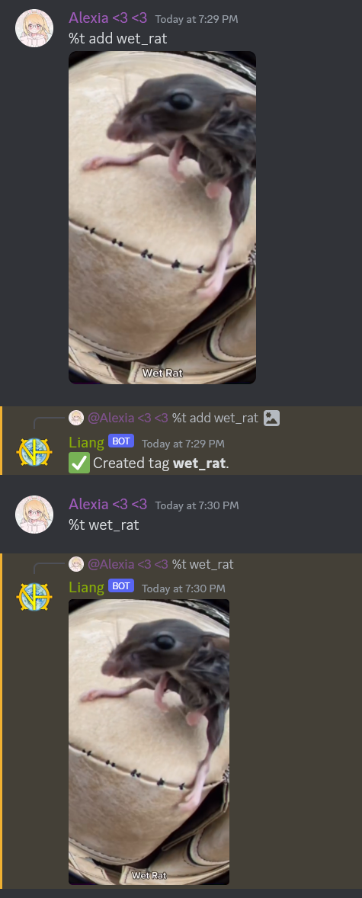
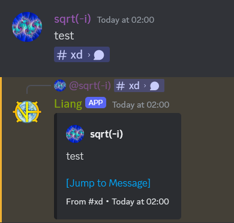
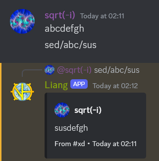
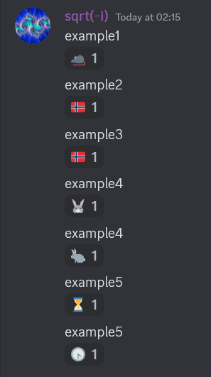
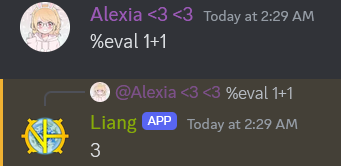

<div align="center"">
    <h1>EL LEVERT JR</h1>
    <br>
    
</div>

<h4 align="center">Romanian version of Leveret by Neeve</h4>

<div align="center">
    <a href="https://opensource.org/license/mit/">
        
    </a>
    <a href="https://discord.js.org/#/">
        
    </a>
    <a href="https://nodejs.org/en">
        
    </a>
    <a href="https://github.com/WeslayCodes/BoarBot/main">
        
    </a>
</div>

<div align="center">
  <a href="#installation">Installation</a>
  •
  <a href="#features">Features</a>
  •
  <a href="#commands">Commands</a>
  •
  <a href="#cli-commands">CLI</a>
  •
  <a href="#websocket-api">WebSocket</a>
  •
  <a href="#evaluation-api">API</a>
  •
  <a href="#configuration">Configuration</a>
  •
  <a href="#startup">Startup</a>
  •
  <a href="#importing">Importing</a>
  •
  <a href="#amogus">Amogus</a>
</div>

# Installation

> [!WARNING]
> This project only supports **Node.js 20.x and 21.x**.
>
> **Node.js 21.7.3 is the final supported version.**
>
> Node.js 22 and newer are not supported.
>
> Use Node.js 20.19.6 if you plan on enabling the inspector features.

Install the bot with:

```bash
npm install --omit=optional
```

Optional runtime support:

- `vm2` support depends on the optional `vm2` package being available
- external language eval support depends on the separate external VM setup being installed on the machine

# Configuration

This section is for bot setup. It covers credentials, feature toggles, interface settings, and the main config files.

## Credentials

You can provide bot credentials in any of these ways:

- `config/auth.json`
- `config/auth.env`
- existing environment variables

Supported environment variable names:

- `LEVERET_TOKEN`
- `LEVERET_OWNER`

If `config/auth.json` exists, the bot uses that file for `token` and `owner`.

If there is no `config/auth.json`, the bot looks for `config/auth.env` and then for the matching environment variables.

`config/auth.json` example:

```json
{
    "token": "bot token",
    "owner": "your discord id"
}
```

`config/auth.env` example:

```dotenv
LEVERET_TOKEN=your bot token
LEVERET_OWNER=your discord id
```

## Main bot config

`config/config.json` controls the main bot behavior, including command prefixes, limits, enabled features, logging, and paths.

Important groups of settings:

- Discord text interface: `cmdPrefix`
- CLI interface: `enableCliCommands`, `cliCmdPrefix`
- WebSocket interface: `enableWebsocket`, `websocketPort`
- Eval modes: `enableEval`, `enableVM2`, `enableOtherLangs`
- Inspector and debugging: `enableInspector`, `enableUserInspector`, timeout and port settings
- Tags and quotas: `maxTagNameLength`, `tagNameRegex`, `maxTagSize`, `maxQuota`
- Reply and output limits: `outCharLimit`, `outLineLimit`, `embedCharLimit`, `embedLineLimit`
- Major features: `enablePreviews`, `enableSed`, `enablePermissions`, `enableReminders`
- Logging and file paths: log files, log level, database path, command paths, Discord log settings

## Reactions config

`config/reactions.json` controls automatic emoji reactions.

At minimum, it can simply disable the feature:

```json
{
    "enableReacts": false
}
```

If reactions are enabled, the file defines the bracket reactions and the word-triggered reactions:

```json
{
    "enableReacts": true,
    "parens": {
        "left": ["left parenthesis emoji ids"],
        "right": ["right parenthesis emoji ids"]
    },
    "funnyWords": [
        {
            "word(s)": "word or [word1, word2]",
            "react(s)": "emoji or [emoji1, emoji2]"
        }
    ]
}
```

## Interface and feature notes

- If `enableCliCommands` is off, the local CLI section in this README does not apply.
- If `enableWebsocket` is off, the WebSocket API is not available.
- If `enableEval` is off, eval commands are not available.
- If `enableVM2` is off, VM2 eval and VM2 tag execution are not available.
- If `enableOtherLangs` is off, `c`, `cpp`, and `py` eval modes are not available.
- If inspector support is off, debug flows described in this README are not available.

# Features

- Discord text commands with a configurable prefix
- Tags with aliases, quotas, search, raw dump, ownership, and script support
- Snapshot-based tag and permission audit history with revision reversion
- JavaScript eval, optional `vm2`, optional other languages, and inspector debugging
- Permission groups with configurable levels
- Reminders delivered by DM
- Message link previews, sed-style replacements, and reaction triggers
- CLI commands for local testing and tag/script emulation
- WebSocket command API for external tools and editor integration

## Updating the bot

Run the following commands to update the bot with the latest code:

```bash
git fetch origin
git reset --soft origin/main
```

# TODO

- [ ] Extract responses into a lang file
- [ ] Rewrite vm2 runner
- [ ] Add cabal (banning)
- [ ] Add the option to save tag attachments locally
- [ ] Add support for slash commands (perhaps)
- [ ] Add support for other databases
- [ ] Add caching
- [ ] Add different behaviour when replying to messages

# Commands

All Discord commands use the bot's text-command prefix. By default that prefix is `%`.

Argument notation used below:

- `(value)` means required
- `[value]` means optional
- `"quoted text"` means keep the text together as one argument

### 1. help

`%help`

Shows the commands you can currently use.

If a command has its own help text, you can usually ask for it with:

`%(command) -help`

### 2. ping

`%ping`

Checks whether the bot is responsive and shows latency information.

### 3. version

`%version`

Shows the version of the bot that is currently running.

### 4. uptime

`%uptime`

Shows how long the bot has been running and when it started.

### 5. tag / t

Tags are saved snippets you can call by name. They are useful for canned replies, reusable snippets, aliases, and script-based responses.

Who uses this:

- everyone for normal tag use
- tag owners for creating and maintaining their own tags
- moderators for moderator-only actions such as `info` and `set_type`

Common usage:

`%tag (name) [args]`

Runs the tag named `(name)`. Any extra text is passed to the tag as its arguments.

Main actions:

- `add (name) [body]` creates a tag
- `edit (name) [new_body]` replaces a tag's body
- `delete (name)` removes a tag
- `rename (name) (new_name)` renames a tag
- `raw (name)` shows the stored body exactly as saved
- `info (name) [raw]` shows stored tag details for moderators
- `owner (name)` shows the owner
- `list [user]` lists your tags or another user's tags
- `search (text) [max_results / all]` searches tag names
- `fullsearch (query) [max_results / all]` searches inside tag bodies
- `random (prefix)` picks a random matching tag
- `count [all/new/script/me/user]` shows counts by scope or type
- `leaderboard (count/size/usage) [limit]` shows tag leaderboards
- `quota` shows how much tag space you are using
- `dump [inline/full] [spaces]` exports tags. `full` sends a JSON file
- `alias (name) (target) [args]` creates an alias-style tag
- `chown (name) (new_owner)` transfers ownership
- `set_type (name) (type|version)` changes script metadata for moderators
- `audit [tag_name] [revision_id] [--options]` shows recent tag changes or a full revision diff for moderators
- `audit_clear [tag_name] [revision_id] [end_revision_id] [--options]` clears tag audit history for the bot owner
- `revert (name) [revision_id]` restores a previous tag state. Tag owners can revert their own latest edit once within one hour; moderators can restore arbitrary revisions.

Examples:

- `%tag audit example` lists recent revisions for `example`
- `%tag audit example 42` shows the before/after diff for revision `42`
- `%tag audit --operation update --limit 20` lists recent tag updates
- `%tag audit_clear` clears all tag audit history (bot owner only)
- `%tag audit_clear example` clears history for one tag
- `%tag audit_clear example 42 45` clears an inclusive revision-ID range for one tag
- `%tag audit_clear example --from "last week" --to "yesterday"` clears a date range for one tag

Tag audit options:

- `--user` or `--actor` filters by the user who made the change
- `--operation` or `--op` filters by `import`, `create`, `update`, `delete`, or `revert`
- `--from` and `--to` filter by a date or time range
- `--page` and `--limit` control pagination

Audit results are shown in a compact paginated embed. Providing a revision ID shows the tracked fields before and after that change. `--from` and `--to` accept natural-language dates and times.

What users should know:

- Tag names are normalized to lowercase.
- Tag names and bodies are validated before the tag is saved.
- You can usually edit, rename, delete, or transfer only your own tags unless you have elevated permissions.
- If a tag name is wrong, the bot may suggest similar tags.

Tag body input:

- Plain text creates a normal text tag.
- A code block creates a script tag.
- Starting the body with `vm2` creates a `vm2` script tag.
- An attached image is stored as an image URL tag.
- An attached text file is stored as script content.
- For `add` and `edit`, admins can also give a local file path instead of inline body text. Absolute paths and `file://` URLs must exist. Relative paths are only treated as files when the file exists.
- If a saved tag uses a Discord-hosted attachment URL, the bot warns that the media can disappear if the original source message is deleted.

### 6. eval

Eval commands run code through one of the bot's script environments.

Who uses this:

- people allowed to use eval features on the server
- admins when file-path input is used

Base usage:

`%eval (script)`

Runs JavaScript in the default eval environment. You can pass inline code, a code block, or an attached text file.

Modes:

- `langs` lists the available eval languages
- `vm2 (script)` runs the script in the VM2 environment
- `c (script)`, `cpp (script)`, `py (script)` run code in those languages when that support is available

What users should know:

- simple text is sent back as text
- objects and arrays are formatted for you
- empty output is rejected
- some modes may be unavailable on a given bot depending on how that bot is set up

Path input:

- Admins can give a local file path instead of inline script text.
- Absolute paths and `file://` URLs must point to a real file.
- Relative paths are only treated as file input when the file exists.

Debugging:

- `%eval debug (script)` starts a debug session when user-facing inspector support is enabled on the bot.

### 7. perm / p

Permission groups decide who can use higher-privilege bot features.

Who uses this:

- moderators and admins
- the bot owner for the highest-level changes

Base usage:

`%perm (subcommand) ...`

Main actions:

- `list` shows groups and levels
- `check (user)` shows a user's permissions
- `add (group_name) (user)` adds a user to a group
- `remove (group_name) (user)` removes a user from a group
- `remove_all (user)` removes all groups from a user
- `add_group (group_name) (level)` creates a group
- `remove_group (group_name)` deletes a group
- `update_group (group_name) [new_name/unchanged] [new_level/unchanged]` updates a group
- `audit [subject] [revision_id] [--options]` shows permission group and membership changes or a full revision diff for permission admins
- `audit_clear [subject] [revision_id] [end_revision_id] [--options]` clears permission audit history for the bot owner
- `revert group (group_name) [revision_id]` restores a group revision for permission admins
- `revert membership (user_id/group_name) [revision_id]` restores a membership revision for permission admins

Examples:

- `%perm audit moderators` lists revisions for the `moderators` group
- `%perm audit moderators 12345` shows the before/after diff for revision `12345`
- `%perm audit user-id/moderators` lists revisions for one membership
- `%perm audit --target permission_group --operation update` lists group updates
- `%perm audit_clear` clears all permission audit history (bot owner only)
- `%perm audit_clear moderators` clears history for one group or membership
- `%perm audit_clear moderators 42 45` clears an inclusive revision-ID range for one subject
- `%perm audit_clear --from "last week" --to "yesterday"` clears a date range

Permission audit options:

- `--user` or `--actor` filters by the administrator who made the change
- `--operation` or `--op` filters by `import`, `create`, `update`, `delete`, or `revert`
- `--target` filters by `permission_group` or `permission_user`
- `--from` and `--to` filter by a date or time range
- `--page` and `--limit` control pagination

Audit results show who changed a group or membership, when it happened, and which fields changed.

What users should know:

- The special `owner` group cannot be edited or removed.
- You cannot add yourself to a group above your own level.
- User arguments may be accepted as a mention, ID, username, or tag depending on the command.

### 8. reminder

Reminders let users schedule a DM for a future time.

Who uses this:

- everyone who can use reminder features on the server

Base usage:

`%reminder (subcommand) ...`

Main actions:

- `add (date) "message"` creates a reminder
- `list` shows your reminders
- `remove (index)` removes one reminder
- `remove_all` removes all reminders

What users should know:

- The date is parsed in natural language, so inputs like `tomorrow 18:00` or `in 2 hours` usually work.
- The message should be quoted when it contains spaces.
- Dates in the past are rejected.
- `remove` uses a 1-based index from your list.
- Reminders are sent to you by DM.

### 9. Utility commands

These are general-purpose helper commands for calculations and lookups.

- `convert (value) (from_unit) (to_unit) [more_units...]` converts between supported units and shows the conversion chain
- `overclock` / `oc` / `oceu` calculates overclock results. The first positional argument may select `standard`, `ebf`, `lcr`, `ce`, or `macerator`; `standard` is the default when omitted. Recipe values follow the mode. Modifiers include `--tape`, `--subtick`, `--rates`, and `--voltage`.
- OCEU behavior is based on [Horde-Of-Greg/oceu](https://github.com/Horde-Of-Greg/oceu).
- `cleanroomcalc` / `crc` takes dimensions such as `5x5x5` and returns the required cleanroom materials
- `stoik` checks whether a chemical equation is balanced. Use `Reactants -> Products`

### 10. Maintenance commands

These are higher-privilege operational commands for moderators, admins, or the bot owner:

- `reload_commands`
- `restart`
- `stop`
- `admin_eval`

# Command usage example



# Other responses

### 1. Previews

The bot can respond to message links with an embed of the message and/or the first attachment when present.

If the link's sender cannot read the original message, the bot does not preview it, which prevents leaking private channels.

Previews can also be generated for message links inside tag output.

Example:



### 2. Sed replace

The following syntax:

`sed/regex/replace/flags`

can be used to replace a pattern in a previous message with another pattern.

When replying, only the referenced message is considered. Otherwise, the bot searches backward for the first matching message.

Match groups can be referenced in the output using `$1`, `$2`, and so on.

Example:



### 3. Reactions

The bot can react to certain words in a message with configured emojis.

It can also react to mismatched brackets if bracket reaction emojis are configured.

Example:



# CLI commands

The CLI is the local command interface for the bot process. When it is enabled, the default prefix is `.`.

What it is for:

- quick local checks without Discord
- testing tag execution with a fake message
- testing script execution with fake author, guild, channel, or tag data

Available commands:

- `.help`
- `.version`
- `.uptime`
- `.clear`
- `.eval (expression)`
- `.vm_eval [--debug/-d] (script)`
- `.execute_tag (name) [args]`
- `.reload_commands`
- `.restart`
- `.stop`

General behavior:

- `.eval` runs a plain JavaScript expression in the local REPL context
- `.vm_eval` runs a full script through the main script environment
- `.execute_tag` runs a stored tag, or an emulated tag if you provide emulation values
- `.clear` clears the terminal
- `.stop` stops the process

File path input:

- `.eval` and `.vm_eval` can take a local file path instead of inline code.
- `.execute_tag` can also take a file path for an emulated tag body.
- Absolute paths and `file://` URLs must exist.
- Relative paths are only treated as files when the target exists. Otherwise the text is treated as normal input.

Common emulation options:

- Message emulation lets you supply author, guild, channel, attachment, and embed data.
- Tag emulation lets you supply tag body, type, language, owner, and tag arguments.
- If you provide tag emulation fields, `.execute_tag` uses the emulated tag instead of loading one from storage.

Examples:

```bash
.eval 1 + 2
.eval ./scripts/test.js
.vm_eval --authorId 123 --authorUsername Alex "return msg.author.username;"
.execute_tag my_tag some args
.execute_tag --tagBody ./tags/example.js --tagType script --tagLanguage js
```

# WebSocket API

The WebSocket API is a command interface for external tools.

Request format:

```json
{
    "id": "optional-request-id",
    "op": "command_name",
    "data": {}
}
```

Response format:

```json
{
    "id": "same-request-id",
    "op": "command_name",
    "status": "success",
    "data": {}
}
```

`status` is either `success` or `error`.

Available commands:

- `help` lists available websocket commands
- `version` returns the bot version
- `uptime` returns uptime information
- `eval` runs JavaScript from `data.code` and returns the output
- `vm_eval` runs a script from `data.code`, with optional debug and emulated message data
- `execute_tag` runs a stored or emulated tag
- `reload_commands`, `restart`, and `stop` return a success flag and a short message

Validation and rules:

- `eval.code` and `vm_eval.code` must be non-empty strings.
- `execute_tag.name` is required unless you provide a `tag` object for emulation.
- Group objects such as `msg` and `tag` reject unknown properties.
- Wrong types are rejected before the command runs.
- Raw websocket commands do **not** guess file paths. If you want to run code from a file, read the file yourself and send its contents.

Emulated objects:

- `msg` can provide fake message, author, guild, and channel data
- `tag` can provide `name`, `aliasName`, `body`, `owner`, `args`, `type`, and `language`

Inspector events:

- `vm_eval` with `"debug": true` sends an `inspector_ready` event before the final response.
- The event payload contains the connection details for the debugger.

Helper scripts:

- `node ./scripts/websocket-client.js` starts an interactive client for the websocket API
- `node ./scripts/websocket-client.js help` sends one command and prints the JSON reply
- `node ./scripts/vscode-debug.js ./path/to/script.js` reads a local file and sends it to `vm_eval` with debugging enabled

The interactive websocket client accepts either full JSON or a lightweight command syntax. Examples:

```txt
help
version
eval 1 + 2
vm_eval debug return "hello";
execute_tag my_tag some args
execute_tag my_tag arg1 arg2 authorId="123" guildName="Test Server"
```

# Evaluation API

### 1. `eval` / pure JS API

Mirrors the API of Leveret; see [Neeve's API documentation](https://gist.github.com/NotMyWing/632d738644c17aa71931169af5cb2767).

Main differences:

- `util.dumpTags(true)` returns a full dump instead of only names
- `msg.reply` exits the script right away
- `util.fetchMessage(ch_id | null, msg_id)` allows fetching a single message
- `util.fetchMessages` accepts message fetch options
- `util.findUserById` allows fetching a user that is not necessarily in the same server as the bot

Output rules:

- Strings are sent as-is.
- Objects and arrays are formatted automatically.
- Empty output becomes `Cannot send an empty message.`

Example:



Inspector behavior:

- When inspector support is enabled without user-facing sessions, the bot exposes one console-driven inspector session at a time.
- When user-facing sessions are enabled, users can start isolated sessions with `%eval debug (script)` and `%t debug (tag_name) [tag_args]`.
- In user-inspector mode, the bot reply includes the DevTools and VS Code connection details.

### 2. `vm2` / NodeJS API

This backend allows more advanced scripts than the pure JS API, including async flows and importing from the allowed module list.

Tags can use VM2 scripts with:

`%t add (name) vm2 (script)`

Result rules:

- If you use `reply`, the script can send directly.
- If you do not use `reply`, return the final value.

### Internal module whitelist:

- assert
- buffer
- crypto
- events
- path
- querystring
- url
- util
- zlib

### Global scope:

- `tag` is available when the script is running from a tag
- `msg` exposes the emulated or real message
- `reply`, `request`, `fetchTag`, `dumpTags`, and `findUsers` are async helpers

### Example:

    %eval vm2 ```js
    return "Amogus";
    ```

# Startup

First-time setup:

1. Install a supported Node.js version.
2. Run `npm install`.
3. Provide bot credentials with either `config/auth.json`, `config/auth.env`, or the `LEVERET_TOKEN` and `LEVERET_OWNER` environment variables.
4. Adjust `config/config.json` and `config/reactions.json` if needed.

Starting the bot:

```bash
npm start
```

What to expect:

- logs are printed to the console
- logs are also written to the configured log files in `logs/`
- the CLI starts only if it is enabled in configuration
- the WebSocket server starts only if it is enabled in configuration

# Importing

To export the current tag database from the bot, use:

`%tag dump full [spaces]`

This sends a `tags.json` file that can be fed to the importer.

Importer usage:

```bash
npm run importer -- --help
npm run importer -- --json-path "path-to-tags.json"
npm run importer -- --json-path "path-to-tags.json" --amend
npm run importer -- --fix
npm run importer -- --purge-old
```

What each mode does:

- `--json-path` imports a JSON tag dump
- `--amend` updates existing tags instead of treating them as conflicts
- `--fix` checks and repairs database issues
- `--purge-old` removes old imported tags

# Amogus

```txt
⠀⠀⠀⠀⠀⠀⠀⠀⠀⠀⠀⣠⣤⣤⣤⣤⣤⣤⣤⣤⣄⡀⠀⠀⠀⠀⠀⠀⠀⠀
⠀⠀⠀⠀⠀⠀⠀⠀⢀⣴⣿⡿⠛⠉⠙⠛⠛⠛⠛⠻⢿⣿⣷⣤⠀⠀⠀
⠀⠀⠀⠀⠀⠀⠀⠀⣼⣿⠋⠀⠀⠀⠀⠀⠀⠀⢀⣀⣀⠈⢻⣿⣿⡄⠀⠀⠀⠀
⠀⠀⠀⠀⠀⠀⠀⣸⣿⡏⠀⠀⠀⣠⣶⣾⣿⣿⣿⠿⠿⠿⢿⣿⣿⣿⣄⠀⠀⠀
⠀⠀⠀⠀⠀⠀⠀⣿⣿⠁⠀⠀⢰⣿⣿⣯⠁⠀⠀⠀⠀⠀⠀⠀⠈⠙⢿⣷⡄⠀
⠀⠀⣀⣤⣴⣶⣶⣿⡟⠀⠀⠀⢸⣿⣿⣿⣆⠀⠀⠀⠀⠀⠀⠀⠀⠀⠀⣿⣷⠀
⠀⢰⣿⡟⠋⠉⣹⣿⡇⠀⠀⠀⠘⣿⣿⣿⣿⣷⣦⣤⣤⣤⣶⣶⣶⣶⣿⣿⠀
⠀⢸⣿⡇⠀⠀⣿⣿⡇⠀⠀⠀⠀⠹⣿⣿⣿⣿⣿⣿⣿⣿⣿⣿⣿⣿⣿⡿
⠀⣸⣿⡇⠀⠀⣿⣿⡇⠀⠀⠀⠀⠀⠉⠻⠿⣿⣿⣿⣿⡿⠿⠿⠛⢻⣿⡇⠀⠀
⠀⣿⣿⠁⠀⠀⣿⣿⡇⠀⠀⠀⠀⠀⠀⠀⠀⠀⠀⠀⠀⠀⠀⠀⠀⠀⠀⢸⣿⣧⠀⠀
⠀⣿⣿⠀⠀⠀⣿⣿⡇⠀⠀⠀⠀⠀⠀⠀⠀⠀⠀⠀⠀⠀⠀⠀⠀⠀⠀⢸⣿⣿⠀⠀
⠀⣿⣿⠀⠀⠀⣿⣿⡇⠀⠀⠀⠀⠀⠀⠀⠀⠀⠀⠀⠀⠀⠀⠀⠀⠀⠀⢸⣿⣿⠀⠀
⠀⢿⣿⡆⠀⠀⣿⣿⡇⠀⠀⠀⠀⠀⠀⠀⠀⠀⠀⠀⠀⠀⠀⠀⠀⠀⠀⢸⣿⡇⠀⠀
⠀⠸⣿⣧⡀⠀⣿⣿⡇⠀⠀⠀⠀⠀⠀⠀⠀⠀⠀⠀⠀⠀⠀⠀⠀⠀⠀⣿⣿⠃⠀⠀
⠀⠀⠛⢿⣿⣿⣿⣿⣇⠀⠀⠀⠀⣰⣿⣿⣷⣶⣶⣶⣶⠶⠀⠀⢠⣿⣿⠀⠀⠀
⠀⠀⠀⠀⠀⠀⠀⣿⣿⠀⠀⠀⠀⠀⣿⣿⡇⠀⣽⣿⡏⠁⠀⠀⠀⢸⣿⡇⠀⠀⠀
⠀⠀⠀⠀⠀⠀⠀⣿⣿⠀⠀⠀⠀⠀⣿⣿⡇⠀⢹⣿⡆⠀⠀⠀⠀⣸⣿⠇⠀⠀⠀
⠀⠀⠀⠀⠀⠀⠀⢿⣿⣦⣄⣀⣠⣴⣿⣿⠁⠀⠈⠻⣿⣿⣿⣿⡿⠏⠀⠀⠀⠀
⠀⠀⠀⠀⠀⠀⠀⠈⠛⠻⠿⠿⠿⠿⠋⠁⠀⠀⠀⠀⠀⠀⠀⠀⠀⠀⠀⠀⠀
```

#

<div align="center">
    
</div>
