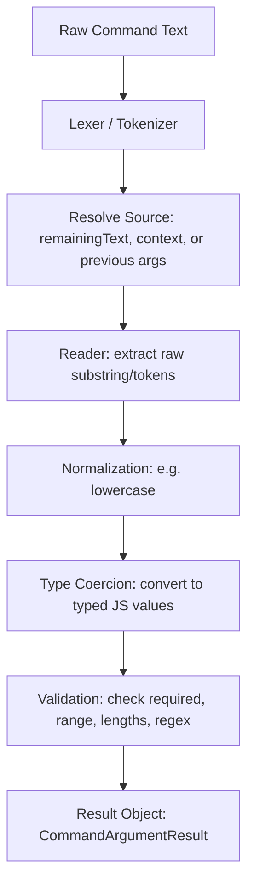

# Command Parser Flow & Schema Reference

The command parser is responsible for taking a raw user text command (e.g., `!tag add alpha --force`) and converting it into a typed, validated, and structured set of argument results based on a predefined argument schema.

This document describes:
1. **The Mental Model**: How the parser breaks down inputs.
2. **The Full Schema Structure**: Detailed explanation of fields, enums, and shorthands.
3. **Core Components**: Lexer, Enums, Readers, Types, and Validations.
4. **Execution Flow**: Step-by-step of the compile and parse phases.
5. **Concrete Examples**: Serialized input/output structures taken directly from unit tests.

---

## 1. The Mental Model

The parser does not parse a command as a single monolithic block. Instead, it is a sequential **pipeline** that processes arguments in the order they are defined.



### State Management
During parsing, state is tracked inside a `CommandParseSession` using:
*   `argsText`: The original input string.
*   `remainingText`: A mutable copy of the input. Options (like `--force`) are physically sliced out of this string as they are read, so subsequent positional or rest readers do not see them.
*   `argsIndex`: A running pointer representing the index of the next positional token to consume.

---

## 2. The Full Schema Structure

A command defines its parameters in `arguments` as an array of argument descriptors. The schema compiler (`schema/CommandArgumentSchema.js`) validates this array against a JSON schema (using AJV) and normalizes it.

### Schema Sub-Modules
The schema definitions are split into clean sub-modules under `src/parsers/command/schema/`:
*   `jsonSchema.js`: Defines the main schema rules.
*   `arraySchema.js`: Validates the argument list array.
*   `readerSchema.js`: Defines parameters allowed in reader configurations.
*   `typeSchema.js`: Validates target argument types.
*   `validSchema.js`: Validates validation rules.
*   `commandArgumentShorthands.js`: Defines expansion rules for schema shorthands.

### Schema Fields

| Field | Type | Description |
| :--- | :--- | :--- |
| `name` | `string` | **Required.** The key under which the result value will be saved. |
| `from` | `string` | The source to read from. Defaults to `"args"` (the command text). Can point to a previous argument's name or an execution context property (e.g. `"message"`). |
| `type` | `string` \| `object` | The target data type. Can be a string name (e.g. `"integer"`) or a detailed configuration object (e.g. for enums). Defaults to `"string"`. |
| `kind` | `string` | Special flag. Setting to `"group"` marks the argument as a structure container composed of nested `properties`. |
| `reader` | `object` | Specifies how raw input is extracted from the source text. |
| `valid` | `object` | Constraints applied to the parsed value (e.g., numeric range, length, pattern). |
| `properties` | `object` | **For `"group"` kind only.** A dictionary of child argument schemas. |

---

### Shorthand Normalizations

To make writing schemas less verbose, the compiler automatically rewrites shorthand forms into a canonical representation:

#### A. Type Shorthand aliases
*   `"int"` $\rightarrow$ `"integer"`
*   `"bool"` $\rightarrow$ `"boolean"`

#### B. Reader Shorthand
Instead of nesting reader properties inside a `reader` object, they can be written at the top level of the argument definition. The compiler automatically moves them inside a `reader` block:
*   Top-level reader fields: `kind`, `index`, `aliases`, `shorthand`, `lowercase`, `separator`, `pattern`, `syntax`.
*   *Example Shorthand:*
    ```json
    { "name": "user", "kind": "option", "shorthand": "u" }
    ```
    *Canonical Form:*
    ```json
    {
      "name": "user",
      "from": "args",
      "type": "string",
      "reader": { "kind": "option", "shorthand": "u" }
    }
    ```

#### C. Validation Shorthand
Top-level validation properties are automatically moved inside the `valid` object:
*   Top-level validation fields: `required` and `allowEmpty`.
*   *Example Shorthand:*
    ```json
    { "name": "count", "type": "integer", "required": true }
    ```
    *Canonical Form:*
    ```json
    {
      "name": "count",
      "from": "args",
      "type": "integer",
      "valid": { "required": true }
    }
    ```

---

## 3. Core Components

### Enum Classes
Constants are extracted into frozen objects to avoid hardcoded string errors:
*   `CommandReaderKinds.js`: Defines reader types (`positional`, `rest`, `list`, `option`, `match`, `group`).
*   `OptionSyntaxTypes.js`: Defines option syntax formats (`dashed`, `named`, `both`).
*   `CommandTypeNames.js`: Defines all target type names (`string`, `integer`, `number`, `script`, `boolean`, `array`, `object`, `enum`, `any`, `group`).

---

### The Lexer (`CommandTextLexer.js`)
Splits text into token objects (`CommandToken`). It understands:
1.  **Separators**: Delimiters (defaults to space ` ` and newline `\n`).
2.  **Quoted values**: Text wrapped in single `'` or double `"` quotes.
    *   Inner quotes can be escaped using backslashes (e.g., `\"`).
    *   Escaped backslashes are unescaped (`\\` $\rightarrow$ `\`).
    *   All other backslashes are kept literally.
3.  **Unclosed Quotes**: If a quote is opened but never closed, the lexer throws a `ParserError` which is caught and logged as an `unclosed_quote` validation issue.

---

### The Readers (`src/parsers/command/reader/`)

Readers extract a raw value (usually a string, token, or array of tokens) from a source. They do not perform type conversion.

*   `PositionalCommandReader` (`kind = CommandReaderKinds.positional`)
    *   Reads the Nth token (specified by `index`).
    *   **Crucial Behavior**: If `index === 0`, it returns only the first token's value. If `index > 0`, it returns the **entire remaining substring** starting at that token index.
    *   Advances `session.argsIndex` to `index + 1`.
*   `RestCommandReader` (`kind = CommandReaderKinds.rest`)
    *   Reads the remaining unconsumed argument string starting from `session.argsIndex` to the end.
    *   Advances `session.argsIndex` to the end.
*   `ListCommandReader` (`kind = CommandReaderKinds.list`)
    *   Tokenizes the source text into an array of raw strings. Does not advance `argsIndex`.
*   `OptionCommandReader` (`kind = CommandReaderKinds.option`)
    *   Scans the text for options. Supported formats:
        *   Dashed: `--user admin`, `-u admin`, `--user=admin`
        *   Named: `user=admin`, `user admin`
    *   Matches are removed from the session's `remainingText` so positional readers do not see them.
    *   If duplicates are found, the last one wins, but a `duplicate_option` issue is recorded.
    *   If it's a boolean option (flag), bare presence evaluates to `"true"`, but can be overridden by a subsequent boolean token (e.g., `--debug false`). Uses `OptionSyntaxTypes` enum.
*   `MatchCommandReader` (`kind = CommandReaderKinds.match`)
    *   Applies a regular expression `pattern` to the source and extracts the capture group at the given `index`.
*   `GroupCommandReader` (`kind = CommandReaderKinds.group`)
    *   Assembles an object using the values of previously parsed child results.

---

### The Types (`src/parsers/command/type/`)

Types take the raw reader output and coerce it into JavaScript values.

*   **Static Type property**: Every type class defines a `static type` matching a value from `CommandTypeNames` (e.g., `static type = CommandTypeNames.integer`).
*   **Nullish Handling**: If the input is `null` or `undefined`, `BaseCommandType` returns success immediately without invoking the specific subclass coercion.
*   **Quote Unwrapping**: If the raw input is a quoted value (wrapped in `CommandQuotedValue`), the type wrapper automatically extracts the inner string before coercion.

#### Supported Types:
1.  `string` (`CommandTypeNames.string`): Returns `String(input)`.
2.  `integer` (`CommandTypeNames.integer`): Uses `Util.parseInt`. Rejects empty strings and decimal numbers.
3.  `number` (`CommandTypeNames.number`): Parses standard and scientific decimals. Rejects commas and invalid formatted digits.
4.  `boolean` (`CommandTypeNames.boolean`): Matches truthy/falsy strings using `Util.parseBool` (e.g., `"yes"`, `"1"`, `"off"`, `"false"`).
5.  `script` (`CommandTypeNames.script`): Parses Discord-style codeblocks (e.g. \` ```js console.log(1) ``` \`). Returns an object: `{ body: string, language: string, isScript: boolean }`.
6.  `enum` (`CommandTypeNames.enum`): Expects an array of homogeneous values (`values` constraint). Compares inputs against permitted options.
7.  `array` (`CommandTypeNames.array`): Accepts an array or parses a JSON string into an array.
8.  `object` (`CommandTypeNames.object`): Accepts a non-null object or parses a JSON string into an object.
9.  `group` (`CommandTypeNames.group`): Accepts objects. Used primarily for structural group arguments.

---

### The Validations

Validation runs on the coerced value inside `CommandArgument.js`. They run in this order:

1.  `required` & `allowEmpty`: If `required` is true and value is missing, validation stops immediately. If empty values are disallowed and the value is empty (empty string, empty script body), validation stops.
2.  `min` & `max`: Range validation for `integer` and `number` types.
3.  `minLength` & `maxLength`: Length validation for `string` and `script` (uses `script.body`).
4.  `regex`: Regex test for `string` and `script` (uses `script.body`).

---

## 4. Step-by-Step Execution Flow

### Phase A: Compile Time
Runs once when a command is loaded.
1.  **Normalization**: Shorthands are expanded, and properties are normalized.
2.  **Schema Validation**: The normalized schema is validated using AJV.
3.  **Group Flattening**: If an argument has `kind: "group"`, its properties are extracted. The compiler generates individual child arguments named `${parentName}_${childKey}` and compiles them. Finally, it appends a synthetic parent argument with `GroupCommandReader` and `GroupCommandType` to collect them.
4.  **Instantiation**: Instances of the matching reader and type classes are constructed.

### Phase B: Parse Time
Runs on every command invocation.
1.  **Session Creation**: A `CommandParseSession` is initialized with the invocation context.
2.  **Sequential Argument Processing**: For each compiled argument:
    *   *Resolve Source*: Read from `context`, `remainingText`, or a previous argument result using `from`.
    *   *Read Raw Value*: Execute the argument's reader.
    *   *Regex Cache*: If a regex `MatchCommandReader` is used, the regex match is cached per source string to avoid redundant processing.
    *   *Lowercase*: If `lowercase` is enabled on the reader, the raw string is lowercased.
    *   *Coerce*: The raw input is converted to a typed value.
    *   *Validate*: The coerced value is checked against validation constraints.
    *   *Record Result*: The result is saved as a `CommandArgumentResult` in `session.results`.
3.  **Applying Issues**: Any parser-level issues (like duplicate options or unclosed quotes) are attached to their corresponding arguments.

---

## 5. Concrete Input/Output Examples

The following structures are real JSON outputs captured during execution of the parser test suite.

### Example A: Basic Positional Arguments
**Schema:**
```json
[
  { "name": "first", "kind": "positional" },
  { "name": "second", "kind": "positional" }
]
```
**Input:** `"hello world"`
**Result Session Object:**
```json
{
    "argsText": "hello world",
    "remainingText": "hello world",
    "argsIndex": 1,
    "valid": true,
    "results": {
        "first": {
            "name": "first",
            "input": "hello",
            "value": "hello",
            "valid": true,
            "issues": []
        },
        "second": {
            "name": "second",
            "input": "hello",
            "value": "hello",
            "valid": true,
            "issues": []
        }
    },
    "issues": []
}
```

---

### Example B: Dashed/Named Options & Remaining Text
**Schema:**
```json
[
  { "name": "debug", "kind": "option", "type": "boolean" },
  { "name": "user", "kind": "option", "type": "integer", "aliases": ["u"] },
  { "name": "title", "kind": "option", "type": "string" },
  { "name": "rest", "kind": "rest" }
]
```
**Input:** `hello --debug --user 123 --title "hello world" remaining text`
**Result Session Object:**
*Notice how `--debug`, `--user 123`, and `--title "hello world"` are completely sliced out of `remainingText`, leaving only the non-option words.*
```json
{
    "argsText": "hello --debug --user 123 --title \"hello world\" remaining text",
    "remainingText": "hello    remaining text",
    "argsIndex": 3,
    "valid": true,
    "results": {
        "debug": {
            "name": "debug",
            "input": "true",
            "value": true,
            "valid": true,
            "issues": []
        },
        "user": {
            "name": "user",
            "input": "123",
            "value": 123,
            "valid": true,
            "issues": []
        },
        "title": {
            "name": "title",
            "input": {
                "value": "hello world",
                "quote": "\""
            },
            "value": "hello world",
            "valid": true,
            "issues": []
        },
        "rest": {
            "name": "rest",
            "input": "hello    remaining text",
            "value": "hello    remaining text",
            "valid": true,
            "issues": []
        }
    },
    "issues": []
}
```

---

### Example C: List Parsing
**Schema:**
```json
[
  { "name": "nums", "kind": "list", "type": "integer" }
]
```
**Input:** `"10 20 30"`
**Result Session Object:**
```json
{
    "argsText": "10 20 30",
    "remainingText": "10 20 30",
    "argsIndex": 0,
    "valid": true,
    "results": {
        "nums": {
            "name": "nums",
            "input": [
                "10",
                "20",
                "30"
            ],
            "value": [
                10,
                20,
                30
            ],
            "valid": true,
            "issues": []
        }
    },
    "issues": []
}
```

---

### Example D: Regex Match Group
**Schema:**
```json
[
  { "name": "id", "reader": { "kind": "match", "pattern": /^\d+/, "index": 0 } }
]
```
**Input:** `"9876-abc"`
**Result Session Object:**
```json
{
    "argsText": "9876-abc",
    "remainingText": "9876-abc",
    "argsIndex": 0,
    "valid": true,
    "results": {
        "id": {
            "name": "id",
            "input": "9876",
            "value": "9876",
            "valid": true,
            "issues": []
        }
    },
    "issues": []
}
```

---

### Example E: Group Reassembly & Error Reporting
**Schema:**
```json
[
  {
    "name": "info",
    "kind": "group",
    "properties": {
      "age": { "type": "integer" },
      "name": { "type": "string" }
    }
  }
]
```
**Input:** `"25 John"`
**Result Session Object:**
*Notice how child properties are parsed as `info_age` and `info_name`. Because the positional index for both is 0, they both read `"25 John"` as input. `info_age` fails integer coercion, causing the overall session to become invalid. The parent `info` object is successfully reassembled but contains the coercion failure values.*
```json
{
    "argsText": "25 John",
    "remainingText": "25 John",
    "argsIndex": 0,
    "valid": false,
    "results": {
        "info_age": {
            "name": "info_age",
            "input": "25 John",
            "value": null,
            "valid": false,
            "issues": [
                {
                    "code": "invalid_integer",
                    "message": "Invalid integer",
                    "ref": {
                        "input": "25 John",
                        "value": null
                    }
                }
            ]
        },
        "info_name": {
            "name": "info_name",
            "input": "25 John",
            "value": "25 John",
            "valid": true,
            "issues": []
        },
        "info": {
            "name": "info",
            "input": {
                "age": null,
                "name": "25 John"
            },
            "value": {
                "age": null,
                "name": "25 John"
            },
            "valid": true,
            "issues": []
        }
    },
    "issues": []
}
```

---

### Example F: Validation Constraint Failure
**Schema:**
```json
[
  {
    "name": "num",
    "kind": "positional",
    "type": "integer",
    "required": true,
    "valid": { "min": 10 }
  }
]
```
**Input:** `"5"`
**Result Session Object:**
```json
{
    "argsText": "5",
    "remainingText": "5",
    "argsIndex": 1,
    "valid": false,
    "results": {
        "num": {
            "name": "num",
            "input": "5",
            "value": 5,
            "valid": false,
            "issues": [
                {
                    "code": "min",
                    "message": "Value must be at least 10",
                    "ref": {
                        "input": "5",
                        "value": 5
                    }
                }
            ]
        }
    },
    "issues": []
}
```

---

### Example G: Lexer Syntax Issue (Unclosed Quote)
**Schema:**
```json
[
  { "name": "text", "kind": "positional" }
]
```
**Input:** `"hello \"world"`
**Result Session Object:**
*Lexer throws a `ParserError`, which is caught by the parser and added as a global session issue.*
```json
{
    "argsText": "hello \"world",
    "remainingText": "hello \"world",
    "argsIndex": 0,
    "valid": false,
    "results": {},
    "issues": [
        {
            "code": "unclosed_quote",
            "message": "Unclosed quote",
            "ref": {}
        }
    ]
}
```
